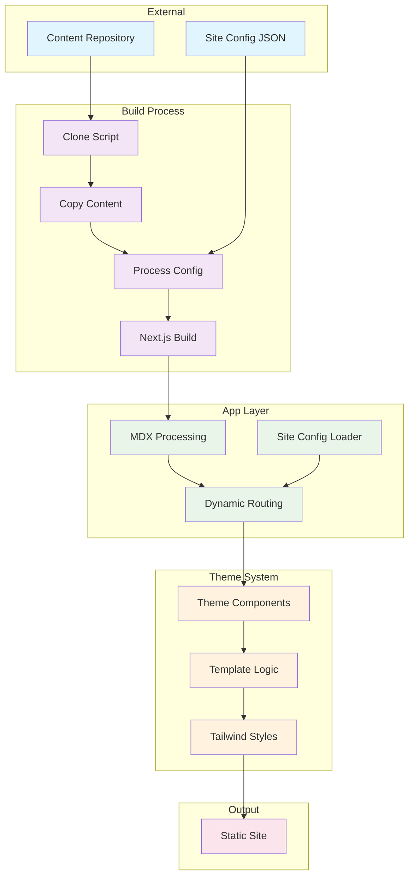

# Web Engine

A static site generator for modern websites, built with Next.js, MDX, and a flexible theme system.

## Quick Start

```bash
# Install dependencies
pnpm install

# Start development server
pnpm dev

# Build for production
pnpm build
```

## Features

- **MDX Content Processing** - Write content in MDX with full React component support
- **Theme System** - Modular, swappable themes with Tailwind CSS
- **External Content** - Clone and process content from external repositories
- **Static Generation** - Full static site generation with Next.js
- **TypeScript** - Full TypeScript support throughout

## Architecture Overview

The web engine follows a modular architecture with clear separation of concerns:



**Key Components:**
- **Content Repository**: External MDX files and configuration
- **Build Scripts**: Automated content processing and Next.js compilation
- **App Layer**: Core Next.js application with MDX processing and dynamic routing
- **Theme System**: Modular React components with Tailwind styling
- **Static Output**: Generated static site ready for deployment

## Project Structure

```
├── app/           # Next.js application
├── themes/        # Theme packages
└── memory-bank/   # Development logs
```

## Development

The development workflow automatically handles content processing:

- `pnpm dev` - Development server with content processing
- `pnpm themes:dev` - Theme development mode
- `pnpm lint` - Code linting
- `pnpm format` - Code formatting

## Building

The build process includes content cloning, configuration processing, and static generation:

1. Clone external content repository
2. Process site configuration
3. Build Next.js application
4. Generate static output

Built for [Dwarves Foundation](https://dwarves.foundation) and other modern websites.
